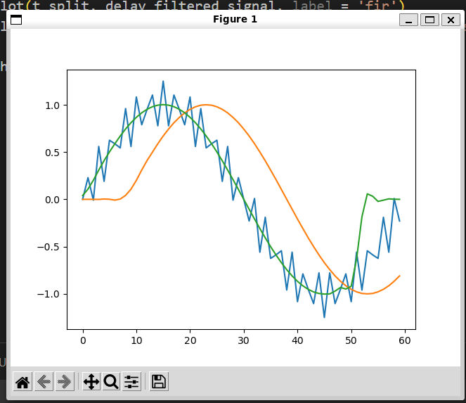

# 实验报告
于新雨 计25 2022010841
## 实现思路
### filter_fir
按照课上讲过的滤波器设计方法写出函数 h 再和输入信号卷积即可。    
注意此时的卷积不能用 `np.convolve` 接口，因为使用 `np.convolve` 的 `mode='same'`，自动将滤波器的中心对齐到输入信号，会正确处理组延迟。       
而我们期望实现的手动卷积实现未考虑滤波器的中心对齐，即滤波器被当作因果滤波器处理，导致信号延迟 8 个采样点。     

### filter_zero_phase
我们按照注释给的提示，先进行正向滤波，再反转，再进行一次滤波，反转即可得到无组延迟的信号。     

## 效果

